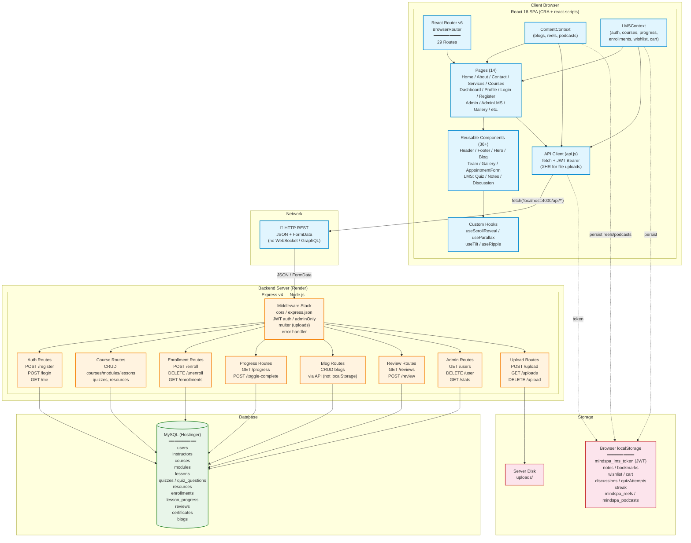

# MindSpa — High-Level Design (HLD)



## Architecture Overview

### Frontend (React 18 SPA)
- **Build Tool**: Create React App (react-scripts 5)
- **Routing**: React Router DOM v6 with 29 routes
- **State Management**: React Context API (ContentContext + LMSContext) + localStorage
- **Styling**: Plain CSS with CSS custom properties (variables), no preprocessor
- **API Client**: Centralized `fetch()` wrapper with JWT Bearer auth in `src/utils/api.js`

### Backend (Express v4 REST API)
- **Runtime**: Node.js
- **Port**: 4000
- **Auth**: JWT (jsonwebtoken) + bcryptjs for password hashing
- **File Uploads**: multer → disk storage
- **Security**: CORS, JWT middleware (`auth`, `adminOnly`), role-based access

### Database (MySQL)
- **Host**: Hostinger remote MySQL (srv547.hstgr.io)
- **Client**: mysql2 (promise-based connection pool)
- **Schema**: 12 tables with auto-seeding on first run

### Data Flow
```
React Component → Context (state) → api.js (fetch) → HTTP → Express Route → MySQL
                                                         ↓
                                                   JWT Validation
                                                         ↓
                                                   Role Check (user/admin)
```
- **Auth flow**: Login → server issues JWT → stored in localStorage → sent as Bearer token on every request
- **Guest mode**: LMS allows browsing without login; soft-enroll stored in localStorage
- **No caching layer** — all reads go directly to MySQL via Express
- **No WebSocket** — all communication is request/response over HTTP

### Key Design Decisions
| Decision | Rationale |
|---|---|
| Monolithic Express server | Single deployable unit, simple ops |
| Context API (no Redux) | Small-to-medium app, avoids extra dependency |
| Plain CSS (no Tailwind/SASS) | Low complexity, custom design system |
| localStorage for ephemeral state | Offline-friendly, no server round-trips for wishlist/cart/notes |
| JWT (no sessions) | Stateless auth, works well with SPA |
| react-scripts (CRA) | Familiar build chain, zero-config |
